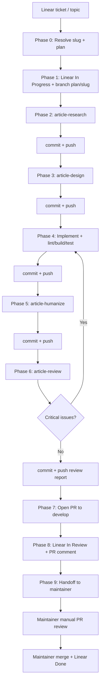

# Pipeline overview

End-to-end flow for [`ship-article`](SKILL.md).

## Actors

| Actor | Responsibility |
|-------|----------------|
| **ship-article agent** | Phases 0–9; open PR; no merge |
| **Maintainer (human)** | Review PR on GitHub; request changes or merge; adjust copy; mark Linear Done |

## Branches

- **Base:** `develop`
- **Feature:** `plan/<slug>` (e.g. `plan/solar-life-cycle`)
- **Not used:** merge to `main` in this pipeline

## Single session vs split

`ship-article` runs **one continuous agent session** through PR open. Child
skills that recommend separate sessions (e.g. plan-to-pr reviewer) are
collapsed into Phase 6 self-review for automation; the maintainer provides the
final human review on GitHub.

## Entry points

| You have… | Attach to agent |
|-----------|-----------------|
| Linear issue | `@ship-article` skill + issue ID/URL |
| Plan only | `@ship-article` + `@plans/concepts/<slug>.md` |
| Topic name | `@ship-article` + "ship solar life cycle" (agent finds plan) |

## Related docs

- [`plans/README.md`](../../../plans/README.md) — plan format + house rules
- Individual skills under `.cursor/skills/article-*/`
